# AWS 에서 Group 과 User 생성하고 로그인하기. 

여느 시스템과 같이 AWS 에서는 Group 을 생성하고, User 들을 생성하며, User 을 그룹에 포함시켜 권한을 부여하는 형태로 작업을 하게 됩니다. 

## Group 생성하기. 

AWS는 Group 을 생성할 수 있는 기능을 제공합니다. 

Group 에 권한을 부여하면, 사용자에 일일이 권한을 부여하는 작업을 하지 않고, 편리하게 그룹 단위로 관리를 할 수 있습니다. 

### Group 생성

IAM > 그룹 을 선택합니다. 

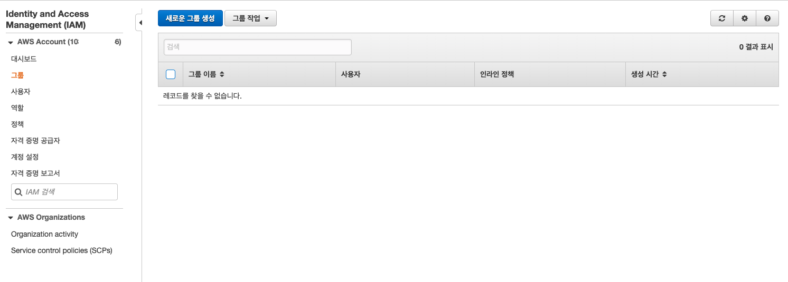

그룹에서 "새로운 그룹생성" 을 선택합니다. 
-----------

### 그룹 이름 지정 
아래와 같이 그룹 이름을 "PilotPrjMnanger" 라는 그룹 이름을 작성해 줍니다. 

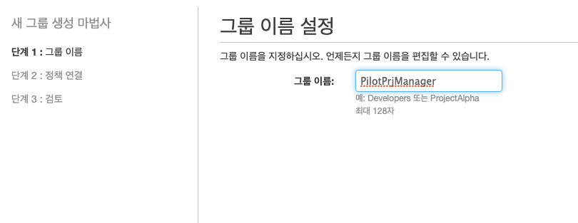

그리고 "다음" 으로 진행합니다. 

----------------------
### 정책 부여하기 

이름을 지정하고 나면, 정책 연결 화면이 나타납니다. 

정책은 AWS Managed Policy 와 Custom Policy 가 있습니다. 

AWS Managed Policy 는 AWS 가 사전에 만들어둔 정책들을 묶어둔 것입니다. 

우리는 AWS Managed Policy 를 그대로 이용하며, 아래 화면과 같이 볼 수 있습니다. 

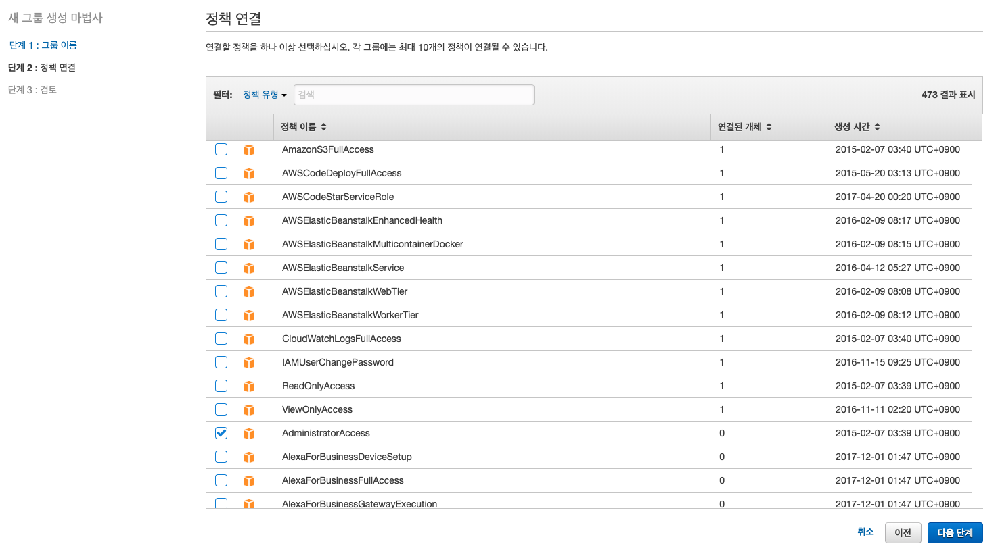

보시는바와 같이 관리자 그룹을 지정할 것이기 때문에 "AdministratorAccess" 를 선택합니다. 

관리자 그룹에 대한 정책을 설정하는 AWS Managed Policy 입니다. 

------------------
## 검토 및 생성 

검토 화면에서는 그룹을 생성하기 전에 한번더 확인하는 화면입니다. 

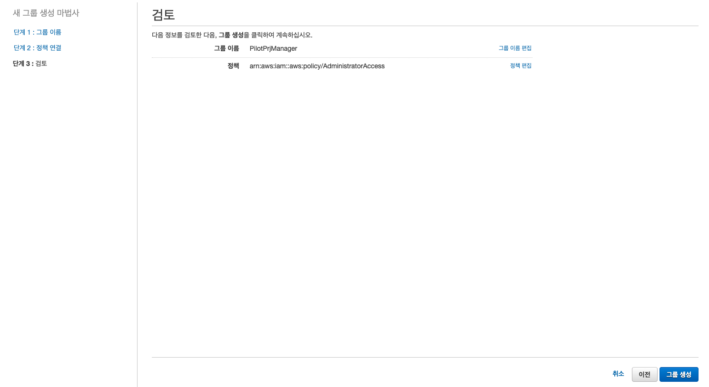

우리가 원하는대로 작성이 되고 있으므로 "그룹 생성" 을 선택합니다. 

만약 이름을 변경하거나, 정책편집을 선택할 수 있습니다. 

--------------------
## 그룹 정책 알아보기 

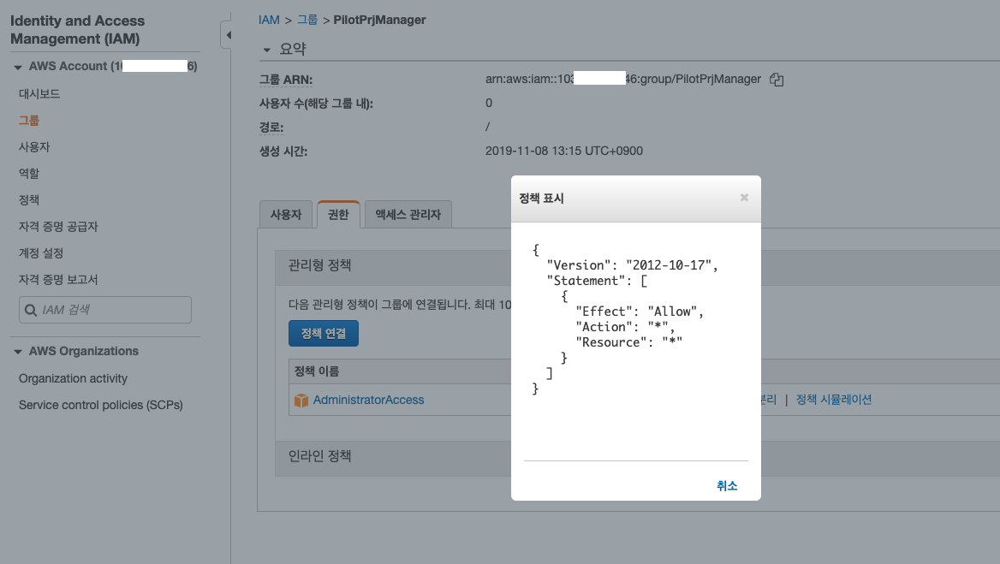

위 화면은 생성된 그룹을 선택하고나서, 권한 > 정책표시 를 선택한 것입니다. 

```
{
  "Version": "2012-10-17",
  "Statement": [
    {
      "Effect": "Allow",
      "Action": "*",
      "Resource": "*"
    }
  ]
}
```

- "Version": 정책이 생성된 시기 입니다.
- Statement.Effect: 이 부분은 "Allow", "Deny" 를 선택하여 허용할지, 거부할지 지정합니다. 
- Statement.Action: 이 부분은 어떠한 액션을 수행할 수 있는지 알려줍니다. "*" 은 전체 권한의 의미입니다. 
- Statement.Resource: 이 부분은 어떠한 리소스에 접근허용/접근불가 를 할지 지정할 수 있습니다. 


예) S3 풀 엑세스 정책 

```
{
  "Version": "2012-10-17",
  "Statement": [
    {
      "Effect": "Allow",
      "Action": "s3:*",
      "Resource": "*"
    }
  ]
}
```

지금까지 그룹과 해당 그룹이 어떠한 정책을 갖는지 확인했습니다. 


## User 생성하기. 

이제는 사용자를 생성해 보겠습니다. 

그룹을 Manager 로 작성했으니, 이제는 관리를 수행할 유저를 생성해 보겠습니다. 

### User 생성하기 

IAM > 사용자를 선택합니다. 

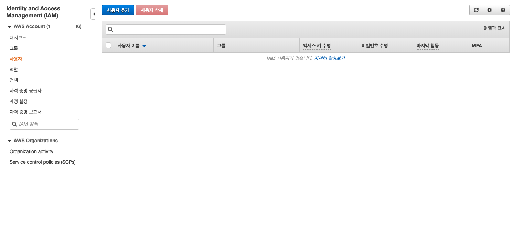

"사용자 추가" 버튼을 선택합니다. 

------------------
### User 이름 부여 

아래와 같이 사용자 이름을 superman 으로 지정합니다. 

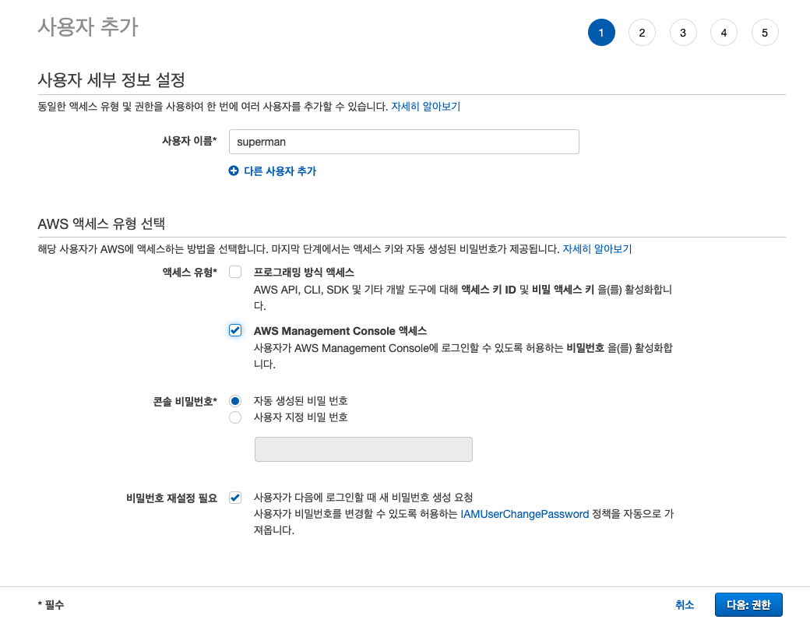

- 엑세스 유형.프로그래밍 방식 엑세스: 이 유형은 AWS API, CLI, SDK 등을 이용하는 사용자를 생성할때 이용합니다. 이들은 Access 키 ID 와 비밀키 엑세스 키를 활성화 합니다. 
- 엑세스.AWS Management Console 엑세스: 이 부분은 AWS 콘솔에 접근하기 위한 형태로 사용자를 만듭니다. 우리는 이 옵션을 선택할 것입니다. 

- 콘솔 비밀번호.자동 생성된 비밀번호: 이를 선택하여 사용자를 선택하면, 임시 비밀번호가 발생되고, 이를 이용하여 로그인 합니다. 아래 비밀번호 재설정 필요와 함께 이용합니다. 
- 콘솔 비밀번호.사용자 지정 비밀번호: 생성할때 바로 비밀번호를 세팅합니다. 

- 비밀번호 재설정 필요: 이 부분은 사용자 비번이 생성되고, 처음 로그인하고 난뒤 비번을 변경할지 지정하는 방법입니다. 

----------------
### 그룹 지정하기  

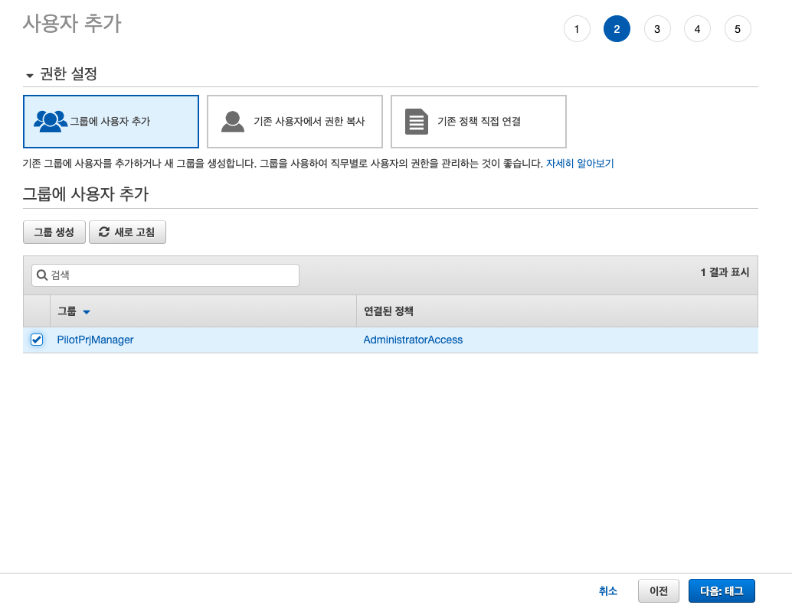

권한설정 화면은 사용자의 권한을 직접 설정할지, 그룹을 이용할지, 혹은 기존 생성된 정책을 복사해와서 사용할지 지정합니다. 

우리는 이미 그룹을 생성하였으니 "그룹에 사용자 추가" 를 선택합니다. 

이전에 생성한 PilotPrjManager 그룹을 선택하고 다음을 선택합니다. 

-----------------
### 태그 설정

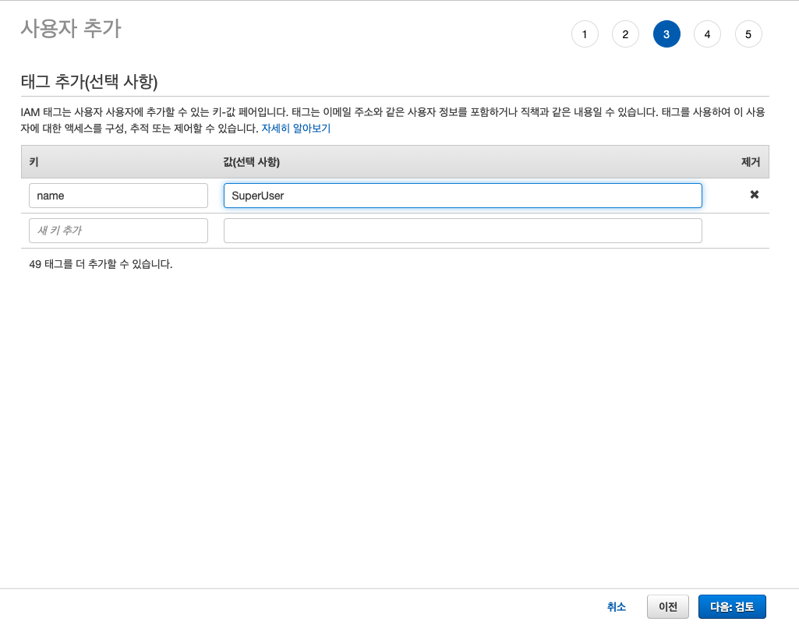

태그 추가 (선택 사항)

태그는 일반적으로 "name" 에 대한 키에, 값을 해당 객체의 이름을 지정해주는 방식으로 주로 이용합니다. 

여기서는 name:SuperUser 로 지정했습니다. 

-----------------
### 검토 및 생성하기

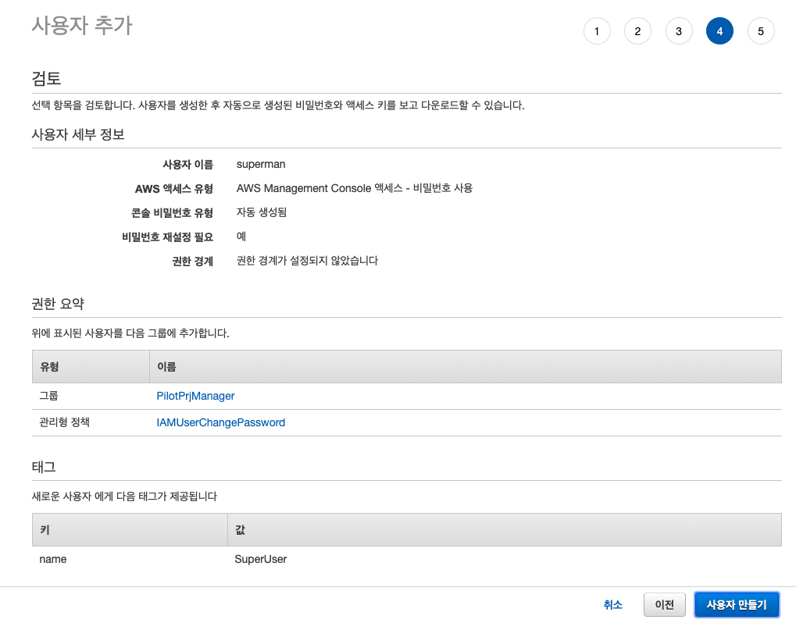

지금까지 설정한 사항을 한번더 검토하도록 보여주는 화면입니다. 

확인이 끝났으면 "사용자 만들기" 를 클릭합니다. 

---------------
### 유저 정보 최종 생성하고, 사용자에게 전달하기 

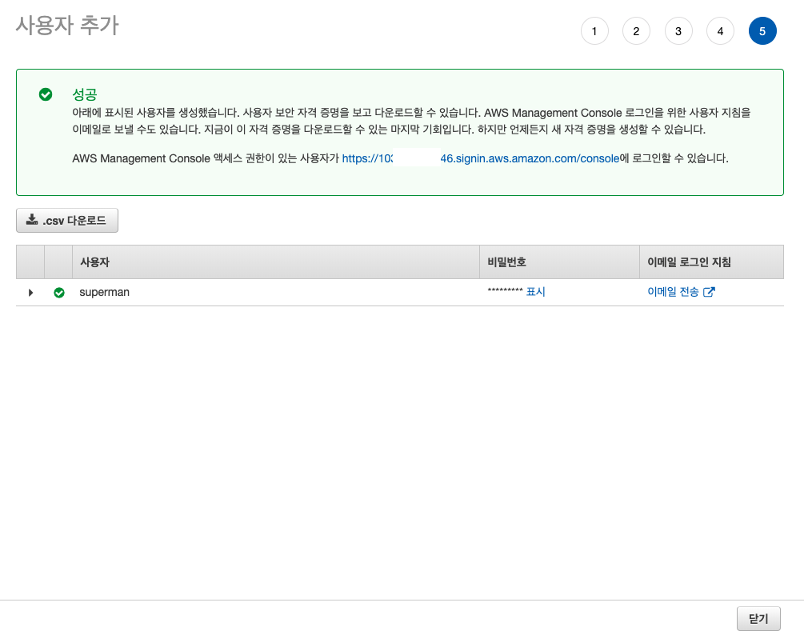

사용자가 만들어지면 위 "성공" 메시지 박스에 사용자 연결 주소가 나타납니다. 

사용자, 비밀번호, 이메일 로그인 지침 등을 확인할 수 있습니다. 

비밀번호를 확인하여 해당 담당자에게 전달하면 됩니다. 

----------------
### IAM 유저 로그인 

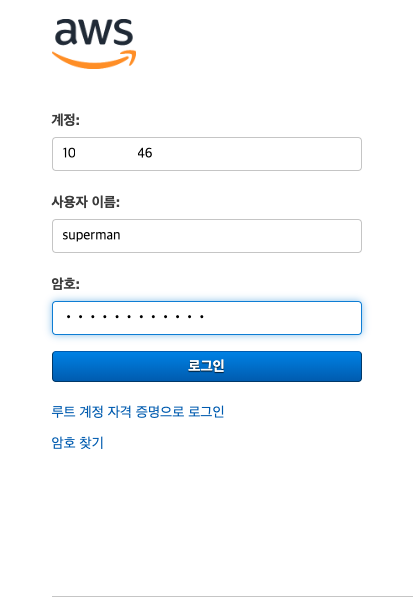

지금 이 화면은 로그인 화면입니다. 

- 계정: 이정보는 IAM 유저를 생성한 aws 루트 관리자의 계정번호입니다. 
- 사용자이름: superman 으로 생성했으니 적어줍니다. 
- 비밀전호: 비밀번호를 입력합니다. 
---------------
### 최초 접근 비번 변경하기 

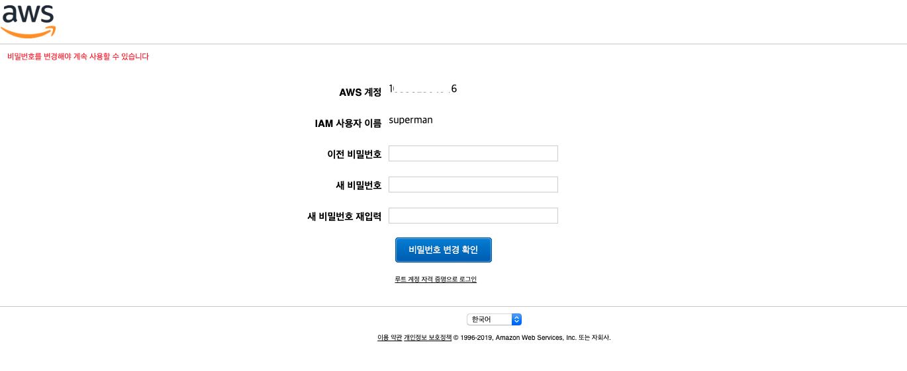

결과적으로 처음 로그인을 하면 비밀번호를 변경하라고 위 화면과 같이 나타납니다. 

비밀번호를 변경해주고나면, 관리자 모드로 AWS 를 이용할 수 있습니다. 

# 결론 
AWS 에서 루트 권한을 이용하지 않도록 하는 것이 좋습니다. 

그리고 모든 사용자는 MFA 를 이용하여 다중 인증을 처리하는 것이 안전합니다. 

AWS 는 대부분의 작업이 비용으로 연결되며, 보안이 매우 중요하기, 때문에 필요한 권한을 만들어서 제한적으로 이용하는 것이 필요합니다. 