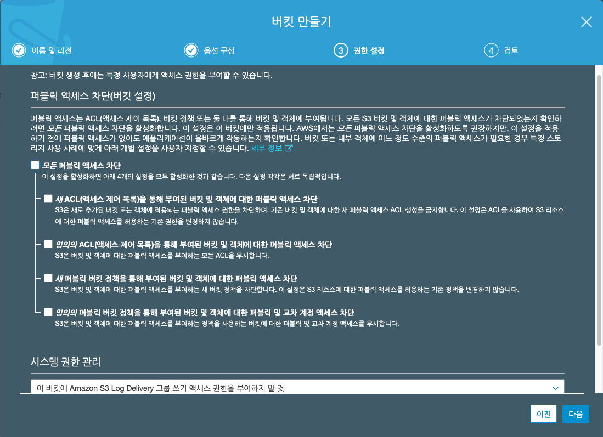

# AWS S3 WebHosing 서비스 하기.

이번에는 AWS 에서 기본이 되는 저장소인 S3를 이용하여 정적 컨텐츠를 서비스하는 웹 호스팅을 해보도록 하겠습니다.

최근 SPA (Single Page Application) 를 이용하여 웹 프로그래밍 구현할때, S3로 웹 호스팅을 수행하는 방법으로 많이 이용하기도 합니다.

## AWS S3 를 아래와 같이 검색합니다.

## S3버킷 생성하기.

버킷이 존재하지 않다면 아래와 같이 버킷을 생성하라를 메뉴가 나옵니다.

버킷이 존재한다면 버킷 리스트가 나타납니다.

위 화면에서 "시작하기" 를 선택해줍니다.

## 버킷 만들기

버킷 만들기 화면에서 생성할 버킷 정보를 생성하빈다.

- 버킷이름: 버킷 이름은 보통 아무 이름이나 작성해도 됩니다. 그러나 다음과 같은 특징이 있습니다.

  버킷 이름은 유일하므로 먼저 선점하는 사람이 임자입니다.

  그리고 내부 데이터 저장용이라면 어떠한 이름으로도 상관 없습니다.

  만약 웹 호스팅을 수행하고, Route53 을 이용한 도메인 연결을 하고자 한다면 content.media.co.kr 과 같이 FQDN 을 사용해주는 것이 좋습니다.

- 리젼: 리젼은 서비스 하고자 하는 리젼을 선택합니다. 한국에서 서비스 한다면 서울 리젼을 선택합니다.
- 기존 비킷에서 설정복사: 버킷이 이미 있다면 복사할 수 있습니다. (동일한 설정을 그대로 이용할 수 있습니다.)

위내용을 참조하여 내용을 입력하고 "다음" 을 선택합니다.

## 버젼 및 추가 속성

아래와 같이 속성 화면에서는 별도로 설정할 것없이 바로 "다음" 으로 넘어갑니다.

## 엑세스 차단 설정 해제하기

퍼블릭으로 호스팅하기 우해서는 "모든 퍼블릭 엑세스 차단" 이 부분 체크를 해제합니다.

## 생성될 버킷 정보 검토하기

생성하고자 하는 사항이 맞는지 확인하고, 버킷을 생성합니다.

## 생성된 버킷 확인하기.

버킷 목록에 위 그림과 같이 버킷이 나타납니다.

해당 버킷클 클릭해줍니다.

## 버킷 처음화면

버킷 화면에 버킷에 서비스할 파일을 올리거나, 정책 설정을 할 수 있습니다.

- 개요: 파일, 폴더등을 생성하거나, 피일을 업로드 할 수 있습니다.
- 속성: 버킷이 제공하는 속성정보를 볼 수 있습니다. (버전관리, 서버 엑세스 로깅, 정적 웹 사이트호스팅, 로깅, 암호화) 등을 설정할 수 있습니다.
- 권한: 권한은 버킷에 접근을 제어하기 위한 정책을 설정하는 곳입니다.
- 관리: 버킷 백업, 사용분석, 지표관리, 등을 확인할 수 있습니다.

## 정적 호스팅 설정하기.

버킷 > 속성 > 정적 웹 사이트 호스팅 을 선택합니다.

- 인덱스 문서: 보통 웹 호스팅이기 때문에 index.html 로 기술해줍니다.
- 오류 문서: 파일을 찾을 수 없거나 하는경우 error.html 페이지가 열릴 수 있도록 설정합니다.

위와 같이 작성하고 "저장" 을 해줍니다.

## 권한 설정하기.

버킷에 접근할 정책을 지정합니다.

에디트 화면만 나타나기 때문에 막막합니다.

기본적인 문법을 알고 있다면 직접 작성해주면 되며, 그렇지 않은경우 아래 "정책 생성기" 를 클릭합니다.

## 정책 생성하기

정책 생성기는 AWS 에서 정책을 생성하는 과정을 어느정도 User Frendly 하게 만든 화면입니다.

- Select Type of Policy: 이 부분을 "S3 Bucket Policy" 로 선택합니다.
- Principal: 은 정책 이름을 지정하는 것으로 '\*' 로 작성합니다.
- Effect: 이 설정은 Allow 로 지정합니다. Allow 는 허옹, Deny 는 불허용으로 정책을 지정합니다.
- AWS Service: 이 부분은 Amazon S3 로 둡니다.
- Action: 액션은 해당 자원에 접근해서 할 수 있는 행위를 지정합니다. 우리는 고객이 호스팅된 화면을 볼 수만 있게 하므로 "GetObject" 를 선택해 줍니다.
- Amazon Reosurce Name (ARN): 이 ARN 은 AWS 에서 상당히 자주 나오는 용어로, 리소스의 이름을 지정합니다. 위 정책이 우리가 만든 어떠한 리소스에 대해서 걸어줄지 설정하는 것입니다.

'Add Statement' 를 선택하면 아래 정책 생성 확인 화면이 나옵니다.

## 정책 검토하기

- Principal: \*
- Effect: Allow
- Action: s3:GetObject
- Resource: arn:aws:s3:::test.bucket00/\*

으로 설정된 것을 확인되었습니다.

'Generate Policy' 를 선택합니다.

## 정책정보 복사

생성된 정책을 복사합니다.

정책 생성기로 만든 내용과 동일한 설정들이 포함되어 있는것을 확인할 수 있습니다.

## 정책 설정하고 저장하기.

권한 > 버킷정책 내부에서 정책을 붙여넣기 하고 저장합니다.

위 보시는바와 같이 퍼블릭 엑세스 권한이 존재함을 알립니다.

## 파일 업로드하기.

초기 생성한 버킷 정보에서 error.html, index.html 을 작성하여 파일을 드래그앤 드롭해줍니다.

'업로드' 를 선택하면 해당 파일이 버킷에 저장됩니다.

## 속성 다시 살펴보기

속성 > 정적 웹 사이트 호스팅 을 선택하면 '엔드포인트' 를 확인할 수 있습니다.

이 URL 경로가 우리가 사용하고자 하는 호스팅 전체 경로입니다.

클릭하면 호스팅 페이지를 확인할 수 있습니다.

## 정상페이지 정보

http://test.bucket00.s3-website.ap-northeast-2.amazonaws.com(http://test.bucket00.s3-website.ap-northeast-2.amazonaws.com)

에 대해서 아래와 같이 화면이 오픈됩니다.

## 오류페이지 보기

http://test.bucket00.s3-website.ap-northeast-2.amazonaws.com/test01(http://test.bucket00.s3-website.ap-northeast-2.amazonaws.com/test01)

위처럼 없는 페이지를 입력하면 아래와 같이 열립니다.

# 결론

S3 로 웹 호스팅은 매우 간단하게 구현할 수 있습니다.

실제로는 현재까지 설정에서 Cloud Front 를 설정하여 CDN 기능을 통해 빠르게 엣지 클라우드에 캐시를 배치하여 고객에게 전달 하는 설정을 하는 것이 필요합니다.

그리고 Route53으로 도메인을 등록하여 서비스를 제공하는 것이 필요합니다.
