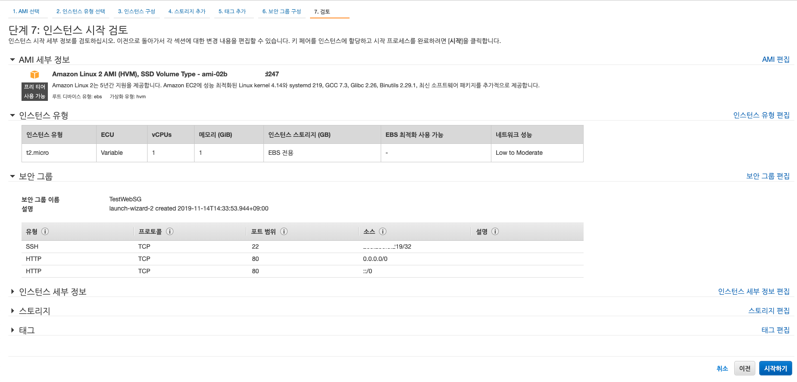
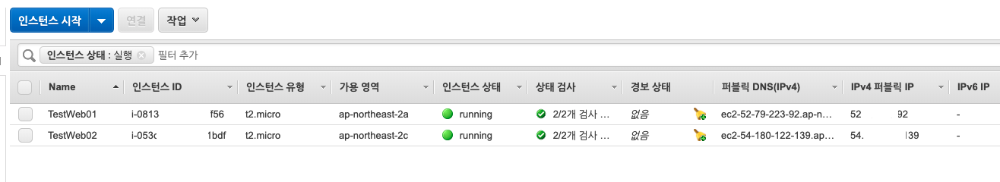

# Elastic Load Balancer 를 이용한 부하분산 연동하기.

테스트 프로젝트나, 정말 소수의 사람이 사용하는 제품이라면 한대의 서버로 서비스를 만들 수 있을 것이지만,

일반적으로 다수의 사람이 사용하는 시스템은 한대의 서버로 서비스 할 수 없습니다. 왜냐하면 한대의 서버를 이용하다가 장애가 발생하는 경우 전체 이용자가 서비스를 전혀 사용할 수 없는 상태에 놓이기 때문입니다.

이럴때 이중화 (High Availability)HA 구성을 해야합니다.

HA 구성에서 중요한 서비스가 바로 로드밸런서 입니다.

## Load Balancer

로드 밸런서는 하나의 로드밸런서에서 서비스를 제공하는 여러대 서비스 앞에 놓이게 되며, 서비스의 상태를 로드밸런서가 체크하여, 정상적인 서비스로만 사용자가 접근할 수 있도록 스위칭 시켜주는 역할을 합니다.

AWS 에서 제공하는 로드밸런서는 3가지 타입으로 제공됩니다.

1. [Application Load Balancer](https://docs.aws.amazon.com/ko_kr/elasticloadbalancing/latest/application/introduction.html): 이것은 어플리케이션에 대한 로드 밸런싱을 합니다. 어플리케이션이라 함은 웹 어플리케이션, API 서버 등과 같이 특정한 포트로 서비스를 수행하는 프로그램을 말합니다. 즉, 프로그램이 정상적으로 수행되면 트래픽을 배분해주고, 서비스가 비정상이면 트래픽을 보내지 않는 역할을 합니다.
2. [Network Load Balancer](https://docs.aws.amazon.com/ko_kr/elasticloadbalancing/latest/network/introduction.html): 네트워크는 특정한 장비 혹은 네트워크 인터페이스 카드에 해당하는 대상으로 트래픽을 보내는 역할을 합니다. 이는 시스템의 장비의 안정성등을 측정하고 트래픽을 보낼지 말지를 결정하는 역할을 수행합니다.
3. [Classic Load Balancer](https://docs.aws.amazon.com/ko_kr/elasticloadbalancing/latest/classic/introduction.html): 이 로드밸런서는 2016년 이전까지의 시스템 환경에서 로드밸런싱을 해주는 서비스 입니다.

AWS 에서 로드밸런서를 이용하는 경우 고가용성 서비스를 위해서 2개의 AZ 를 두고, 각각의 AZ 에 소비스를 기동하도록 가이드 하고 있습니다.

## Load Balancer 구성하기

Load Balancer 구성하여, 고가용성 서비스를 구축해 보도록 하겠습니다.

### EC2 인스턴스 생성하기.

우리는 EC2 인스턴스를 2개 생성할 것입니다.

하나는 AZ1 에 생성하고, 다른 하나는 AZ2 에 생성하는 방법으로 구성할 예정입니다.


#### EC2 인스턴스 생성하기. 

EC2 화면에 아래와 같이 들어가서 '인스턴스 시작' 을 클릭합니다. 


#### AMI 를 선택합니다. 

AMI (Amazon Machine Image) 의 약자로 OS 가 설치된 이미지입니다. 우리는 여기서 가장 첫번째 AMI 를 선택할 것입니다. 

일반적으로 Redhat 기반의 리눅스입니다. 


#### 인스턴스 유형 선택하기.

인스턴스 유형은 장비의 사양을 의미합니다. 

우리는 여기서 t2.micro 를 선택하겠습니다. 


#### 인스턴스 세부 정보 구성 

인스턴스 세부정보에서는 생성할 인스턴스 개수, 어느 VPC, Subnet 등에 생성할지를 결정할 수 있습니다. 

우리는 여기서 서브넷을 기본값 ap-northeast-2a 를 선택하겠습니다. 

참고로 '종료 방지 기능 활성화' 를 체크하면 인스턴스를 바로종요하는 실수를 방지할 수 있어 체크하는 것이 좋습니다. 


#### 스토리지 추가 

스토리지는 기본적인 스토리지를 이용하겠습니다. 그냥 넘어가겠습니다. 


#### 태그추가

AWS 에서 태그는 매우 중요합니다. 사실 AWS 에서 인스턴스 ID 를 기억하기는 쉽지 않습니다. 

그러므로 'name' 태그를 의미있게 지정하는 것이 좋습니다. 태그를 지정하면 인스턴스를 선택할때 태그도 함께 보이므로 실수하지 않고 작업할 수 있습니다. 

여기서는 'Name' : 'TestWeb01' 으로 지정하겠습니다. 


#### 보안그룹 구성 

보안그룹은 외부에서 해당 인스턴스로 접근할때 방화벽 정책을 어떻게 할지 지정하는 것입니다. 

여기서는 기본 보안그룹 말고 새로운 보안그룹을 생성하겠습니다. 

보안그룹 이름: TestWebSG
추가 정책 : HTTP 을 선택하면 자동으로 값이 세팅됩니다. 

참고: 보안그룹에서 22번 SSH 접근에서 '소스' 부분은 반드시 내IP 로 지정해주도록 해야합니다. 
그렇지 않으면 누구나 접근할 수 있기 대문에 보안 취약점이 발생됩니다. 


#### 인스턴스 시작 검토

생성하기 전에 검토는 신중히, 자신이 생성할 인스턴스와 맞는지 다시한번 확인합니다. 



#### 키페어 생성

여기서는 이전에 생성한 키페어를 사용하겠습니다. 

매 인스턴스마다 키페어를 생성하는 것은 번거롭고, 유실하는 경우 다시 발급받을 수 없기 때문에 특정 그룹별로 키페어를 생성하거나 하는 정책을 잘 만들어 이용할 필요가 있습니다. 


#### 시작상태

인스턴스 생성이 되고 있음을 알려주는 상태 정보를 나타냅니다. 


'인스턴스보기' 를 선택하면 인스턴스가 생성되는 화면을 확인할 수 있습니다. 

#### 처음 ELB 화면에서 새로운 서버 추가 생성하기 

인스턴스가 생성이 되면, 현재 생성되고 있는 사양과 동일한 인스턴스를 생성할 수 있습니다. 

마우스 오른쪽 클릭 > 기존 인스턴스를 기반으로 시작 을 선택하면 현재 생성되는 인스턴스와 동일한 인스턴스를 생성할 수 있습니다. 


#### 인스턴스 시작검토

기존 인스턴스로 시작을 수행하면 동일한 인스턴스 검토 상황으로 이동합니다. 

여기서 '인스턴스 세부정보 편집' 을 선택합니다. 


#### 인스턴스 세부정보 편집 

기존과 완젼 동일한 인스턴스를 생성하지만 AZ 는 다른곳으로 변경해보고자 합니다. 

'인스턴스 세부정보 편집' 을 클릭하면 아래 화면으로 변경됩니다. 

여기서 서브넷을 ap-northeast-2c 로 설정합니다. 


#### 태그 추가하기

새로 인스턴스의 태그를 아래와 같이 바꿔줍니다. 


#### EC2 메인화면에서 생성상태 최종확인

EC2 메인화면으로 가면 생성한 인스턴스를 확인할 수 있습니다. 




### Nginx 설치하기 

#### 인스턴스 접속하기. 

이제는 생성된 인스턴스에 nginx 를 설치하도록 해보겠습니다. 

인스턴스 선택 > 연결 을 클릭하면 인스턴스에 접근할 수 있는 경로가 나타납니다. 

```
> cd aws_key_pair <-- 다운로드 받은 키페어가 있는 디렉토리로 이동 

> ssh -i "nginx-kido.pem" ec2-user@ec2-52-XX-XXX-02.ap-northeast-2.compute.amazonaws.com

Last login: Thu Nov 14 07:04:33 2019 from 203.236.8.219

       __|  __|_  )
       _|  (     /   Amazon Linux 2 AMI
      ___|\___|___|

https://aws.amazon.com/amazon-linux-2/
No packages needed for security; 1 packages available
Run "sudo yum update" to apply all updates.

```

위 와 같은 방법으로 서버에 진입합니다. 

#### nginx 설치하고 실행하기 

```

> sudo yum upgrade  <-- yum 을 최신으로 갱신합니다. 

sudo amazon-linux-extras install epel <-- epel 은 nginx 를 설치하기 위한 의존성 패키지입니다. aws 는 이렇게 명령어로 실행합니다.

sudo yum install nginx <-- nginx 를 설치합니다. 

sudo systemctl start nginx  <-- nginx 시작은 이렇게 ...
sudo systemctl stop nginx   <-- nginx 종료는 이렇게 ...
sudo systemctl enable nginx <-- 서비스 구동시 자동으로 nginx 실행시 이렇게....
```

#### nginx 설치확인 

인스턴스 url 을 통해 브라우저 접근을 수행하면 다음과 같이 nginx 설치 결과가 브라우저로 노출됩니다. 


** 나머지 서버도 위와 동일하게 작성해줍니다. **

### Load Balancer 설정하기. 

이제 드디어 로드 밸런서 설정을 수행할 차례입니다. 

#### 로드밸런서 생성하기 

EC2 > 로드밸런싱 > 로드밸런서 메뉴를 선택합니다. 


위 화면에서 '로드 밸런서생성' 을 클릭합니다. 


#### 로드밸런서 선택하기. 

로드밸런서는 3가지중 선택이 가능합니다. 

이전에 설명한대로 Application Load Balancer, Network Load Balancer, Classic Load Balancer 가 있습니다. 

우리느 ㄴ여기서 Application Load Balaner 를 선택할 것입니다. 


#### 로드밸런서 구성 

이름 : TestWeb 
체계 : 인터넷 연결
IP 주소유형 : IPV4
가용영역: 가용영역을 northeast-2a, 3c 를 체크해줍니다. 이 부분은 멀티 AZ 로드밸런싱을 수행하도록 해줍니다. 


생성을 합니다. 

#### 보안 설정 구성 

로드밸런서를 위처럼 만들면 보안 구성이 안되어 있습니다. 

아래 경고가 나오면 다음으로 보안그룹 설정을 수행하도록 합니다. 


#### 보안그룹 구성

로드밸런서를 위한 보안 그룹을 구성해 보겠습니다. 


보안 그룹 할당: 새 보안 그룹 생성
보안 그룹 이름: TestWebLB 라고 해줍니다. 
유형: 사용자지정:TCP:80 으로 지정하면 로드밸런서로 들어오는 80을 허용하겠다는 의미가 됩니다. 

생성하기를 선택합니다. 

#### 라우팅 구성 

이제는 로드밸런서가 라우팅을 수행하는 라우팅 대상그룹을 설정하겠습니다. 

로드밸런서가 리퀘스트를 받으면 이 라우팅 대상 그룹으로 분배하게 됩니다. 


대상그룹 : 새 대상 그룹
이름 : TestWebELBGroup
대상유형: 인스턴스 
프로토콜: HTTP
포트: 80

프로토콜: HTTP
경로: /

위처럼 해줍니다. 

고급 상태 검사의 경우 로드밸런서가 분배할 대상의 헬스체크를 어떠한 기준으로 할지 지정하는 사항입니다. 

#### 대상등록 

로드밸런서 그룹에 포함될 인스턴스를 선택합니다. 

아래 인스턴스를 선택하고 '등록된 항목에 추가' 를 선택하면 됩니다. 

다른 방법도 있기 때문에 이 단계에서는 '등록된 항목에 추가' 를 클릭하지 않고 다음으로 가보겠습니다. 


#### 검토하기

생성할 로드밸런서 정보를 검토할 수 있습니다. 

대상에 인스턴스가 없다는 것을 확인할 수 있습니다. 이전으로 가서 등록해줘도 되고, 나중에 등록해도 됩니다. 

생성해보겠습니다. 


#### 생성상태 보기

아래와 같이 생성상태를 간략히 볼 수 있습니다. 


#### 로드밸런서 확인하기. 

다시 EC2 > 로드밸런싱 > 로드밸런서 를 클릭하고, 

생성한 로드밸런서를 선택합니다. 

그리고 하단 탭에서 '대상' 을 클릭해 봅니다. 


위와 같이 대상이 없습니다. 

이전 검토할때 대상을 등록하지 않았기 때문입니다. 

'편집' 을 클릭합니다. 

#### 로드밸런스 대상 추가하기 

대상 등록 또는 등록 취소 화면이 나타나면 


맨아래 인스턴스를 전체 체크하고, '등록된 항목에 추가' 를 해줍니다. 

'저장' 을 하면 끝납니다.

#### 등록후 상태 확인

로드밸런서 등록을 하게되면 잠시동안 등록된 대상이 미등록 상태가 됩니다. 

얼마간의 시간이 흐르면 아래 화면과 같이 상태가 'healthy' 로 바뀌어 있습니다. 


정상적으로 ELB 가 인스턴스에 80 포트로 / 라는 곳에 요청을 보냅니다. 

요청 결과가 200 OK 로 나가면서 nginx 가 정상으로 떠있다 라고 파악합니다. 

그러므로 양쪽 인스턴스로 트래픽이 전달되고 있는 상태임을 확인할 수 있습니다. 

#### 인스턴스 내려보기 

이제는 ELB 가 정상동작 하는지를 보기 위해서 인스턴스 TestWeb02 정지 시켜 보겠습니다. 


정지된 화면을 보았다면 이제는 다시 ELB 상태를 확인해 보겠습니다. 

#### 상태 보기 

EC2 > 로드밸런싱 > 로드밸런서 를 선택하고, 우리가 생성한 로드밸런서를 클릭합니다. 

아래 탭에서 '대상' 을 선택하면 아래와 같이 상태를 확인할 수 있습니다. 


보시는 바와 같이 unused 상태이며 설명은 Target is in the stopped state 라고 나타납니다. 

#### 스티키 세션으로 특정 클라이언트 접속을 고정하기. 

스티키 세션은 클라이언트가 서버에 접속할때 매번 동일한 서버로 접속되도록 해주는 속성입니다. 

최근 서비스는 이런 스티키 세션을 사용하지 않지만, 필요한경우 유용하게 이용할 수 있습니다. 

참고로 최근 아키텍팅은 공용 캐시를 두고, 세션정보를 공용캐시에 접속하며, 클라이언트 요청이 들어오면 서버에서 공용캐시 정보에서 클라이언트 정보를 찾아서 서비스를 해주는 방식으로 구성됩니다. 


위 화면과 같이 EC2 > 로드밸런싱 > 대상그룹 을 선택하고, 우리가 만든 대상그룹을 체크합니다. 

작업 > 속성편집을 클릭합니다. 


그리고 속성 편집 화면이 나타나면 위와 같이 고정 부분을 체크하니다. 

체크한 후 고정 지속시간을 10분 으로 설정하고 저장합니다. 

이렇게 되면 요청은 한쪽 인스턴스로만 전달 해줍니다. 


