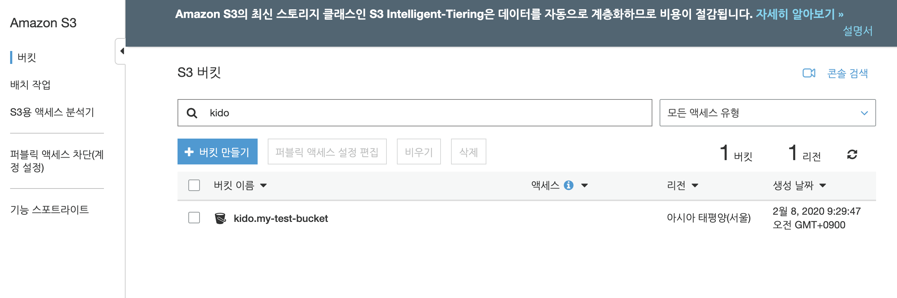

# AWS CLI 로 Bucket 만들어보기.

aws-cli 를 설치하고, 사용자에게 S3 접근 권한을 부여하였다면 S3에 오퍼레이션을 할 수 있습니다.

## 버킷 생성하기.

make bucket 의 의미로 mb 옵션을 줄 수 있습니다 .

```
aws s3 mb s3://<new-bucket-name>
```

```
aws s3 mb s3://my-test-bucket
```

### 테스트를 수행해봅니다.

```
aws s3 mb s3://my-test-bucket

make_bucket failed: s3://my-test-bucket An error occurred (BucketAlreadyExists) when calling the CreateBucket operation: The requested bucket name is not available. The bucket namespace is shared by all users of the system. Please select a different name and try again.
```

Bucket 이름이 이미 있다고 합니다.

어! 나는 해당 이름의 버킷이 없는데? 라고 할 수 있습니다.

그러나 Bucket 은 전세계에서 유일한 이름이어야합니다. (선점 방식이죠.)

- 만약 자신만의 멋진 버킷 이름이 있다면 미리 선점해 두셔야 합니다. ^^

이제 제대로 된 버킷 이름을 만들어 보겠습니다.

```
aws s3 mb s3://kido.my-test-bucket

make_bucket: kido.my-test-bucket
```



정상으로 만들어 졌습니다.

## 파일 업로드 하기.

이제 버킷에 파일을 업로드 해 보겠습니다.

```
touch test.txt

echo 'Hello I'm Kido's Bucket' >> test.txt
```

```
aws s3 cp test.txt s3://kido.my-test-bucket --acl public-read

upload: ./test.txt to s3://kido.my-test-bucket/test.txt
```

파일이 업로드 되었습니다.

실제 올라갔는지 확인해 보겠습니다.


정상으로 업로드 되었네요. 

## 버킷 내용 보기. 

버킷 내용을 보고자 한다면 다음 명령어를 이용합니다. 

```
aws s3 ls s3://kido.my-test-bucket

2020-02-08 09:35:17          0 test.txt
```

버킷 목록은 

```
aws s3 ls
```

## 이제 버킷 파일을 로컬에 다운로드 하겠습니다. 

올렸으니 다운로드를 해야겠지요? 

```
aws s3 cp s3://kido.my-test-bucket/test.txt download_test.txt

download: s3://kido.my-test-bucket/test.txt to ./download_test.txt
```

이처럼 로컬 디렉토리에 download_test.txt 파일로 다운로드 되었습니다. 

## 결론

지금까지 s3를 aws-cli 를 통해 접근하는 방법을 알아 보았습니다. 

버킷생성, 파일업로드 및 다운로드를 해 보았습니다. 

직접 접근하니, 콘솔을 열어서 클릭하는 것보다 더 편리한것(?) 같습니다. 
