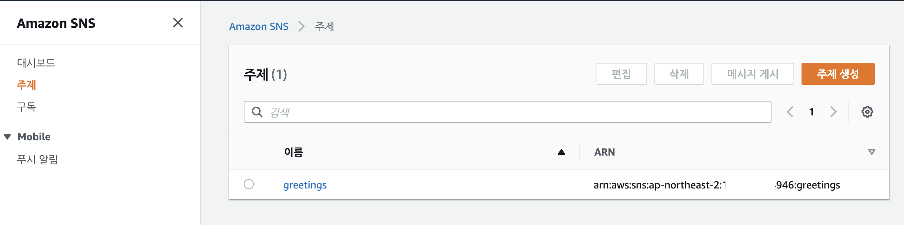
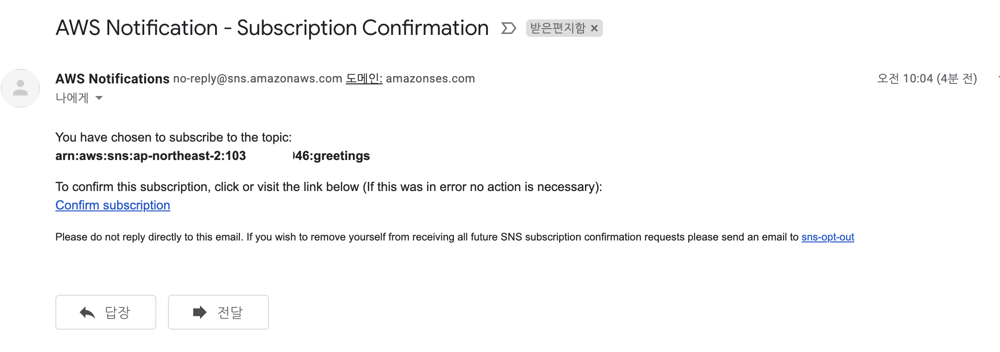
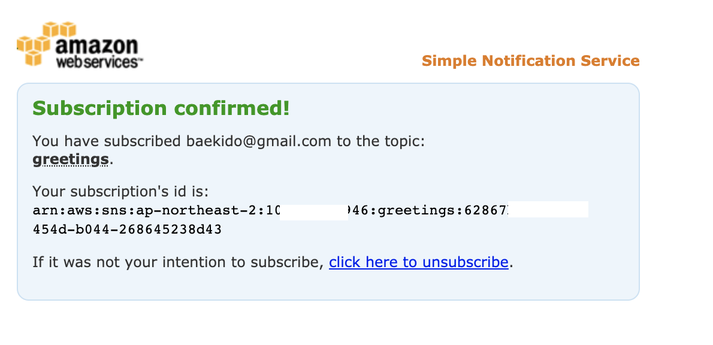
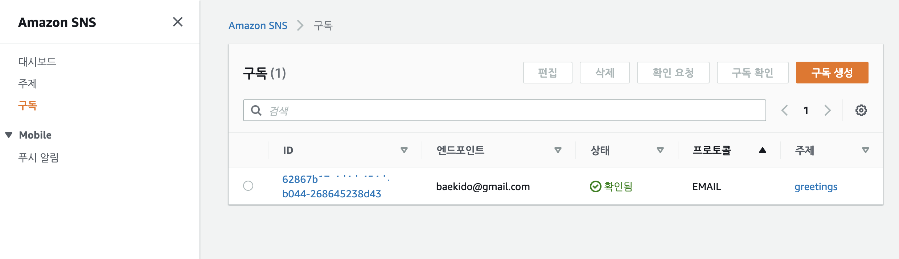
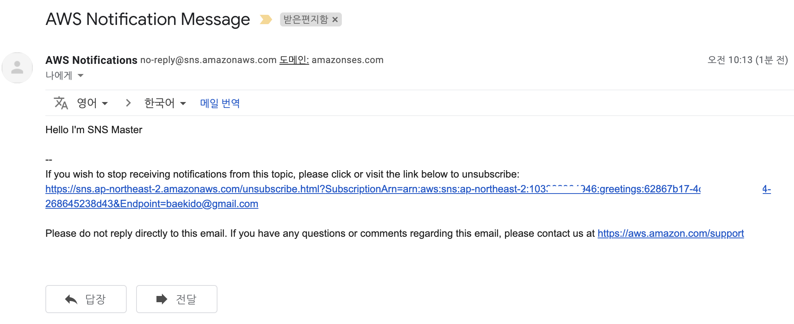

# SNS(Simple Notification Service)

SNS 는 AWS 에서 Pub-Sub 메시징 서비스 입니다.

Topic 을 만들고 해당 Topic 에 메시지를 Publishing 수행하면, 이를 이용하는 쪽에서 Subscribing 할 수 있습니다.

## Topic 생성

우선 Topic 을 생성해야합니다. 그래야 토픽을 서로 바라보고 메시지를 교환 할 수 있습니다.

인사를 하는 토픽을 생성해 봅시다.

```
aws sns create-topic --name greetings

{
    "TopicArn": "arn:aws:sns:ap-northeast-2:1033XXXX4946:greetings"
}
```

위 결과를 확인해보면 greetings 라는 이름의 토픽이 생성되었습니다.

토픽을 생성하면 arn 이 생성됩니다. 

arn 은 (Amazon Resource Name) 을 이야기하며, 결국 AWS 의 서비스를 가리키는 고유한 이름이라고 생각하면 됩니다. 

### 생성된 토픽을 console 에서 확인하기. 



보시는 바와 같이 Amazon SNS > 주제 메뉴에서 내용을 확인할 수 있습니다. 

## 구독하기. 

이제는 구독을 설정합니다. 

구독을 하는 것은 개인 메일로 메시지를 받아보도록 하겠습니다. 

```
aws sns subscribe --topic-arn arn:aws:sns:ap-northeast-2:1033XXX4946:greetings --protocol email --notification-endpoint baekido@gmail.com 

{
    "SubscriptionArn": "pending confirmation"
}
``` 

* subscribe 은 수신을 의미합니다 .
* --topic-arn 은 이전 만든 토픽의 arn 을 기술하겠다는 의미입니다. 그리고 다음으로 arn 을 기술해 줍니다. 
* --protocol 은 토픽을 수신받을 프로토콜을 나타냅니다. https://docs.aws.amazon.com/sns/latest/dg/welcome.html 을 참조하세요. 


## Topic 수신 confirm 하기. 

위 수신 등록결과는 pending confirmation 상태로 되어 있습니다. 

이제는 승인을 해줘야하지요? 

등록한 메일주소로 가서 다음과 같이 확인을 해줍니다. 



컨펌을 하면 다음과 같이 확인창이 나옵니다. 



구독 현황을 다음과 같이 확인할 수 있습니다. 




## 토픽에 메시지 발생시키기 

이제 토픽에 메시지를 Publishing 해보겠습니다. 

```
aws sns publish --topic-arn arn:aws:sns:ap-northeast-2:103XXX4946:greetings --message "Hello I'm SNS Master"

{
    "MessageId": "cc19179f-6c2f-5e33-9226-41276154c618"
}
```

메시지를 보냈습니다. 

* publish 는 메시지를 퍼블리싱 하겠다는 의미입니다. 
* --topic-arn 토픽의 리소스 이름을 지정해줍니다. 
* --message 는 보낼 메시지입니다. 여기서는 Hello I'm SNS Master 라고 했습니다. 

## 결과 확인하기. 

이제 정말 메시지가 메일로 왔는지 확인해봐야겠죠? 



메일로 메시지가 전송되었음을 확인할 수 있습니다 .

## 결론

aws cli 를 이용하여 토픽을 생성하고, 메일로 받아 보았습니다. 

정말 활용도가 많을듯 하네요, 특정 이베트가 발생되면 토픽으로 메시지를 전송하고, 메일로 받으면 됩니다. 

aws 의 간단함이 놀랍습니다. 
